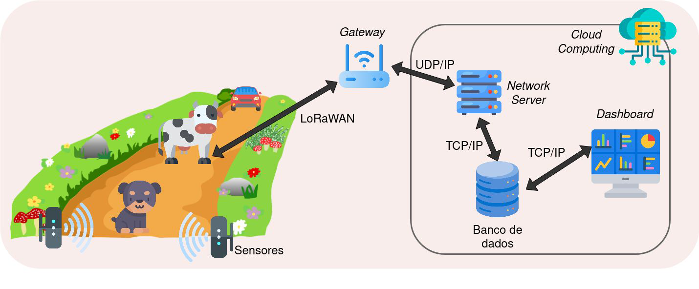
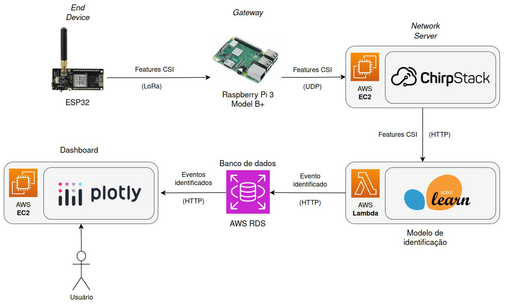
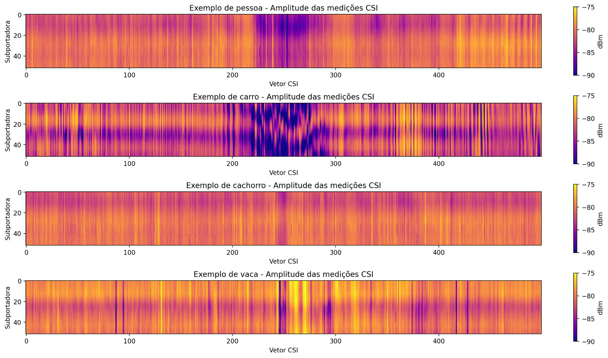
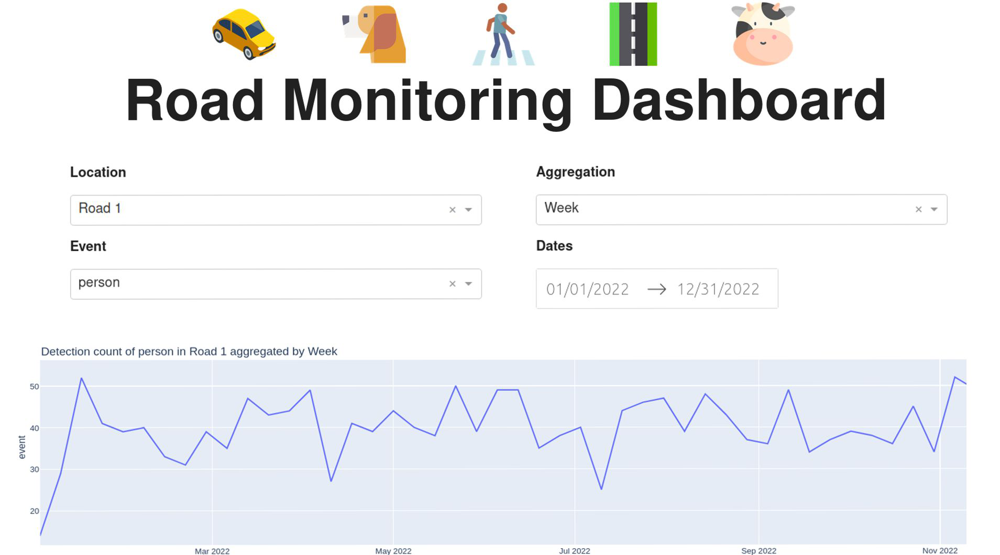
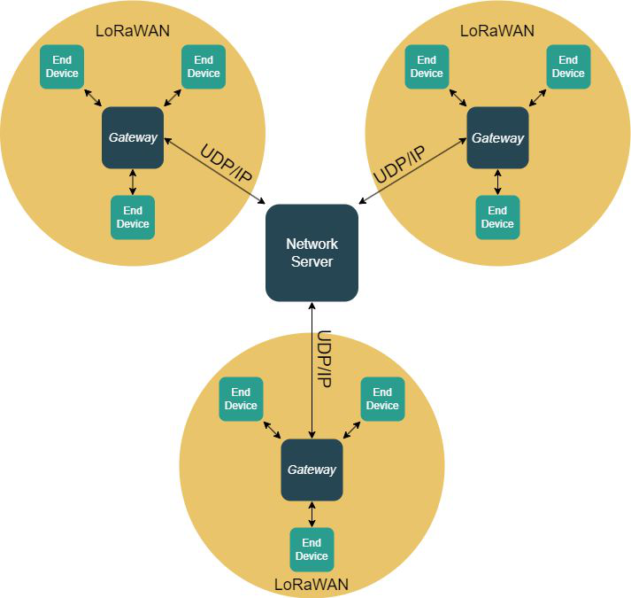

# Sensoriamento WiFi e rede LPWAN: uma arquitetura fim-a-fim
Trabalho de conclusão do curso de Engenharia de Computação na Poli-USP.

Integrantes:
- Camila Lobianco
- Enzo Neves
- Paulo Sestini

Professora orientadora:
- Profa. Dra. Cintia Borges Margi

# Resumo
O monitoramento de estradas permite a detecção de acidentes, melhoria da segurança no trânsito e melhor planejamento urbano. Entretanto, sua implementação em vias remotas, longe de centros urbanos e de rodovias,  é dificultada, pois há falta de infraestrutura de rede e energia adequada. Neste trabalho, é proposta uma aplicação de monitoramento  de baixo custo e baixo consumo energético, baseada em Internet of Things (IoT). Utiliza-se sensoriamento baseado em rádio WiFi IEEE 802.11 a partir de placas ESP32.  Para comunicação de baixo consumo energético e longas distâncias, utiliza-se a tecnologia de rede Long Range Wide Area Network (LoRaWAN). Os eventos de detecção são centralizados em nuvem, identificados por meio do uso de Machine Learning, e apresentados em um dashboard.

# Motivação
- Desenvolver um método de monitoramento de tráfego de baixo custo e baixo consumo energético, apropriado para implementação em vias remotas.
- Construção de uma arquitetura fim-a-fim que integre sensoriamento WiFi e redes LPWAN (Low Power Wide Area Network).
- Grande leque de possibilidades graças a evolução das tecnologias de IoT e sistemas embarcados, especialmente no que diz respeito ao desenvolvimento de soluções de baixo custo.

# Arquitetura: solução fim-a-fim
- Sensoriamento de eventos, transmissão via LPWAN, identificação de eventos, armazenamento e visualização em um dashboard.
- Uso de computação em nuvem para construção do servidor e processamento de dados

# Sensoriamento
- Monitoramento do canal de comunicação WiFi IEEE 802.11, por meio da coleta de dados Channel State Information (CSI), permite perceber perturbações eletromagnéticas entre os sensores causadas pela passagem de objetos.
- Modelo KNN (K-Nearest Neighbors) é ajustado por meio de aprendizado supervisionado, a partir de features extraídas de dados CSI.
- Sensores detectam eventos por meio da queda no sinal e transmitem features. KNN previamente ajustado identifica os eventos.
- Possivel detectar e identificar carros, pessoas, cachorros e vacas.

# Comunicação
- Arquitetura LoRaWAN constitui uma estrela de estrelas.
Sensores transmitem eventos via LoRa para gateways.
- Gateways recebem pacotes LoRaWAN, e repassam para servidor central via conexão UDP.
- Comunicação é criptografada e todo sensor deve ser identificado e permitido na rede.

# Visualização
- Dashboard construída em Plotly exibe eventos coletados e identificados.
- Possibilidade de filtrar eventos por localidade, intervalo de tempo, tipo de evento e realizar agregações diárias, semanais e mensais.

# Resultados
- Solução completa para monitoramento de vias remotas, de baixo custo, baixo consumo energético e rede de longo alcance.
- Acurácia acima de 90%, chegando até 98%, na classificação dos dados, dependendo do tradeoff entre quantidade de dados enviados e alcance da rede.
- Detecção e identificação de carros, pessoas, cachorros, vacas. - Detecção de possíveis perigos na via.

